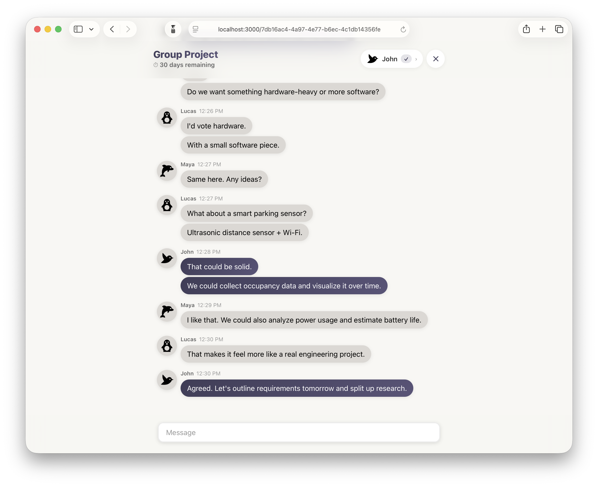
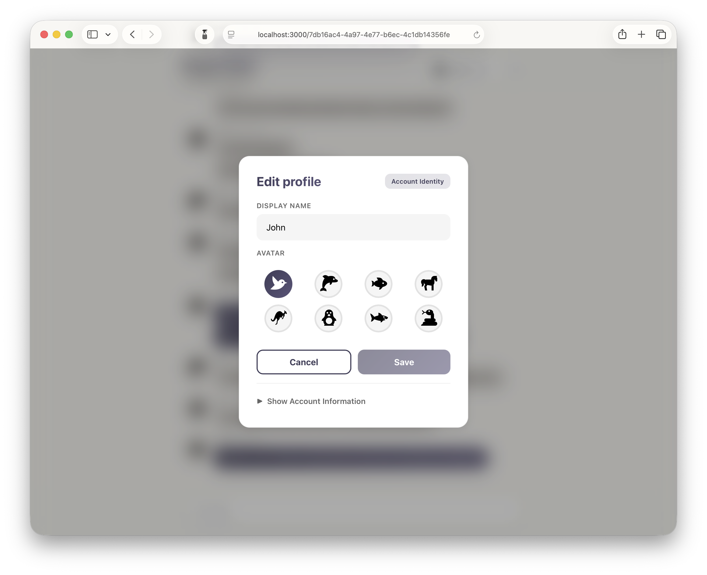
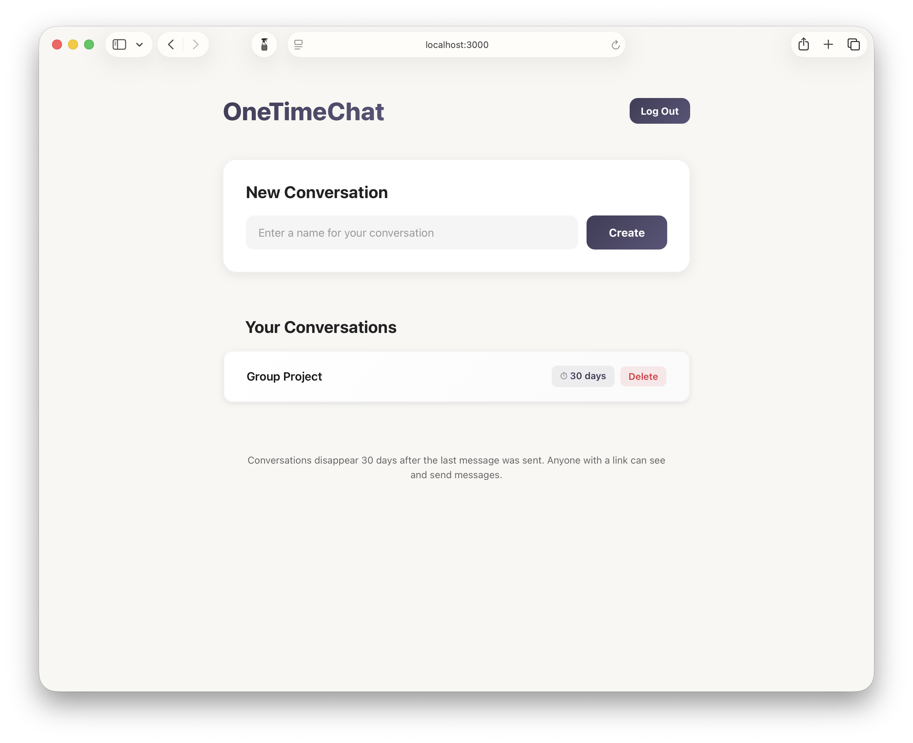
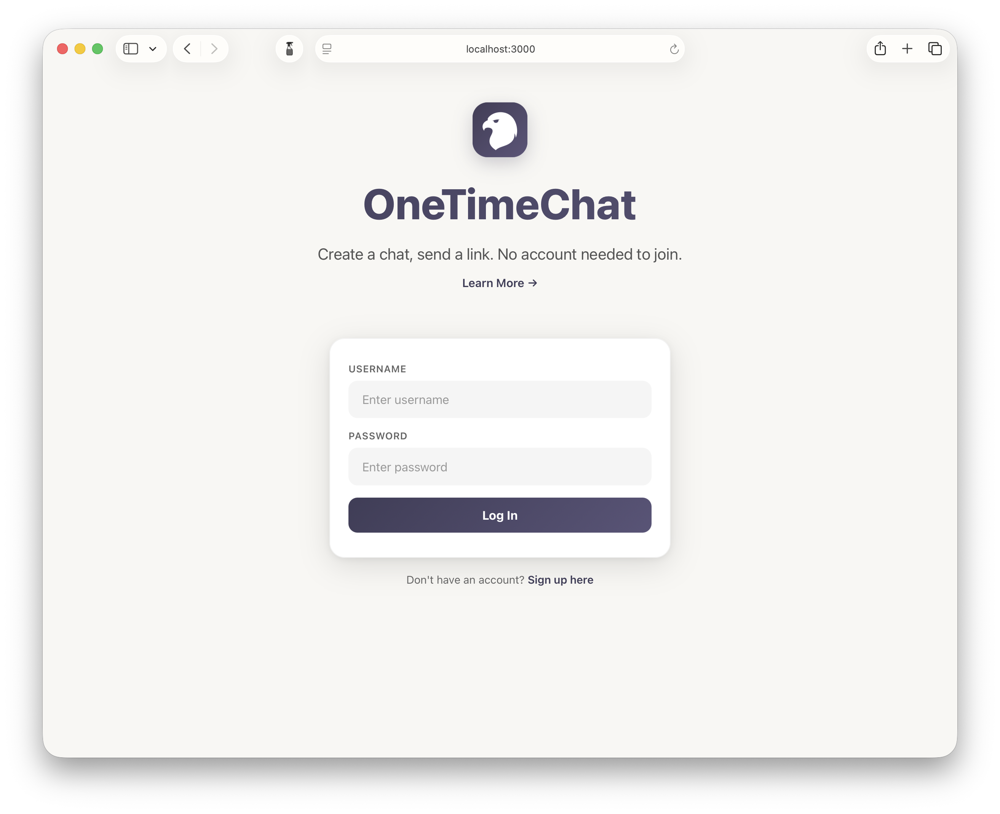

# Web Messages - Complete Application Stack


<details>
    <summary><strong>More Screenshots</strong></summary>
  
  
  

</details>

This repository provides a complete development environment for the Web Messages application stack using Docker Compose. It orchestrates three services across two repositories, with hot-reload capabilities for rapid development:

- **Backend Service** ([web-messages-service](https://github.com/appdevjohn/web-messages-service)) - Express.js REST API with Socket.IO for real-time messaging. The PostgreSQL database (schema setup, Dockerfile, and `pg_hba.conf`) lives inside this repo under `database/`, since the service depends on it.
- **Frontend PWA** ([web-messages-pwa](https://github.com/appdevjohn/web-messages-pwa)) - React Progressive Web App

## Features

- Send group messages anonymously without account creation
- Link-based conversation access
- Real-time messaging via Socket.IO
- Conversations automatically deleted after 30 days of inactivity
- Optional user authentication for creating conversations
- Optional email verification and password reset

## Development Features

- **Hot Reload**: Code changes are reflected immediately without rebuilding containers
- **Development Mode**: Services run with development configurations (NODE_ENV=development)
- **Live Code Editing**: Bind mounts sync your local code changes to containers in real-time
- **Fast Iteration**: Make changes and see results instantly in your browser

## Prerequisites

- [Docker](https://docs.docker.com/get-docker/) and [Docker Compose](https://docs.docker.com/compose/install/)
- [Make](https://www.gnu.org/software/make/) (usually pre-installed on macOS/Linux)
- Git

## Quick Start

This will set up a complete development environment with hot-reload enabled for both frontend and backend.

1. Clone this repository:

   ```bash
   git clone https://github.com/appdevjohn/web-messages
   cd web-messages
   ```

2. Copy the environment file and configure it:

   ```bash
   cp .env.example .env
   ```

   Edit `.env` and set at minimum:

   - `TOKEN_SECRET` - A secure random string for JWT signing
   - Other settings as needed (see Configuration section below)

3. Run the setup command:

   ```bash
   make setup
   ```

   This will:

   - Clone the two project repositories (`web-messages-service`, `web-messages-pwa`) into subdirectories
   - Build Docker images for all services using development Dockerfiles

4. Start the application in development mode:

   ```bash
   make start
   ```

   All services will start with hot-reload enabled. Code changes in `web-messages-service` and `web-messages-pwa` will be reflected immediately.

5. Access the application:

   - **Frontend**: http://localhost:3000 (with Vite HMR)
   - **Backend API**: http://localhost:8000 (with nodemon auto-restart)
   - **Database**: postgresql://localhost:5432

6. Start developing:
   - Edit files in `web-messages-service/src/` or `web-messages-pwa/src/`
   - Changes will be reflected automatically without rebuilding containers
   - View logs with `make logs` to see server restart notifications

## Available Commands

Run `make help` to see all available commands:

| Command        | Description                                |
| -------------- | ------------------------------------------ |
| `make setup`   | Clone repositories and build Docker images |
| `make clone`   | Clone the two project repositories         |
| `make build`   | Build all Docker images                    |
| `make start`   | Start all services                         |
| `make stop`    | Stop all services                          |
| `make restart` | Restart all services                       |
| `make logs`    | View logs from all services                |
| `make pull`    | Pull latest changes from all repositories  |
| `make clean`   | Remove cloned repos and Docker volumes     |

## Configuration

### Required Environment Variables

Edit the `.env` file to configure the application. The most important settings are:

**Security:**

- `TOKEN_SECRET` - **REQUIRED** - JWT signing secret (use a long random string)

**Database:**

- `POSTGRES_USER` - Database username (default: `user`)
- `POSTGRES_PASSWORD` - Database password (default: `password1`)
- `POSTGRES_DB` - Database name (default: `messages_db`)

**Application:**

- `APP_NAME` - Application name displayed to users (default: `OneTimeChat`)
- `APP_BASE_URL` - Frontend URL (default: `http://localhost:3000`)
- `BASE_URL` - Backend URL (default: `http://localhost:8000`)

### Optional Features

**Email Verification:**
Set `VERIFY_USERS=true` and `SEND_EMAILS=true` to enable email verification. Requires:

- `SENDGRID_API_KEY` - Your SendGrid API key

**Image Uploads:**

- `ENABLE_UPLOADS` - Set to `true` to allow image uploads in messages (default: `false`)

## Development Workflow

### Making Changes

The two project directories (`web-messages-service`, `web-messages-pwa`) are separate Git repositories with bind mounts for live development. The PostgreSQL database now lives inside the service repo at `web-messages-service/database/`:

**Backend Service (web-messages-service):**

1. Edit TypeScript files in `web-messages-service/src/`
2. Changes are automatically detected and the server restarts (via nodemon)
3. No rebuild or restart needed - just refresh your API requests

**Frontend PWA (web-messages-pwa):**

1. Edit React components in `web-messages-pwa/src/`
2. Vite's hot module replacement (HMR) updates the browser instantly
3. No rebuild or restart needed - changes appear immediately

**Database (web-messages-service/database):**

1. The schema and Docker setup (`setup.sql`, `Dockerfile`, `pg_hba.conf`) live in `web-messages-service/database/`.
2. Schema changes require rebuilding the database container:
   ```bash
   make build
   make restart
   ```

### When to Rebuild

You only need to rebuild containers when:

- Installing new npm dependencies (updating `package.json`)
- Changing Dockerfile or Docker configuration
- Modifying database schema or initialization scripts

To rebuild a specific service:

```bash
docker compose build service  # Backend only
docker compose build pwa      # Frontend only
docker compose build db       # Database only
make restart                  # Restart all services
```

### Updating to Latest Version

To pull the latest changes from all repositories:

```bash
make pull
make build
make restart
```

### Viewing Logs

To view logs from all services:

```bash
make logs
```

To view logs from a specific service:

```bash
docker-compose logs -f service-name
```

Service names: `db`, `service`, `pwa`

## Troubleshooting

### Services won't start

1. Check if ports 3000, 5432, or 8000 are already in use:

   ```bash
   lsof -i :3000
   lsof -i :5432
   lsof -i :8000
   ```

2. Check service logs:
   ```bash
   make logs
   ```

### Database connection errors

1. Ensure the database service is healthy:

   ```bash
   docker-compose ps
   ```

2. Check database logs:

   ```bash
   docker-compose logs db
   ```

3. Verify environment variables in `.env` match between services

### Frontend can't connect to backend

1. Verify `VITE_API_BASE_URL` in `.env` is set to `http://localhost:8000`
2. Check that the backend service is running:
   ```bash
   docker-compose ps service
   ```
3. Test the backend directly:
   ```bash
   curl http://localhost:8000/health-check
   ```

## Production Deployment

This setup is configured for local development with hot-reload and development dependencies. For production deployment, you'll need to:

1. **Use Production Dockerfiles**: Create production Dockerfiles (without `.dev` suffix) that:
   - Build optimized production bundles
   - Use `NODE_ENV=production`
   - Don't include development dependencies
   - Don't use bind mounts (code should be copied into image)
2. **Update docker-compose.yml**: Reference production Dockerfiles instead of `Dockerfile.dev`
3. **Environment Configuration**:
   - Set secure passwords and secrets
   - Configure proper CORS settings
   - Set `NODE_ENV=production`
4. **Infrastructure**:
   - Use a reverse proxy (nginx/Caddy) for SSL termination
   - Enable SSL/TLS certificates (Let's Encrypt)
   - Set up proper database backups and persistence
   - Configure email service (SendGrid) if using email features
5. **Security**:
   - Remove or secure exposed ports
   - Use Docker secrets for sensitive values
   - Implement rate limiting and security headers

## License

Each component has its own license. Refer to the individual repositories for details.

## Contributing

To contribute to any of the components, please refer to their respective repositories:

- [web-messages-service](https://github.com/appdevjohn/web-messages-service) (includes the database under `database/`)
- [web-messages-pwa](https://github.com/appdevjohn/web-messages-pwa)

## Support

For issues related to:

- **Database setup** - Open an issue in [web-messages-service](https://github.com/appdevjohn/web-messages-service/issues) (the database lives under `database/`)
- **Backend API** - Open an issue in [web-messages-service](https://github.com/appdevjohn/web-messages-service/issues)
- **Frontend UI** - Open an issue in [web-messages-pwa](https://github.com/appdevjohn/web-messages-pwa/issues)
- **This integration** - Open an issue in this repository
